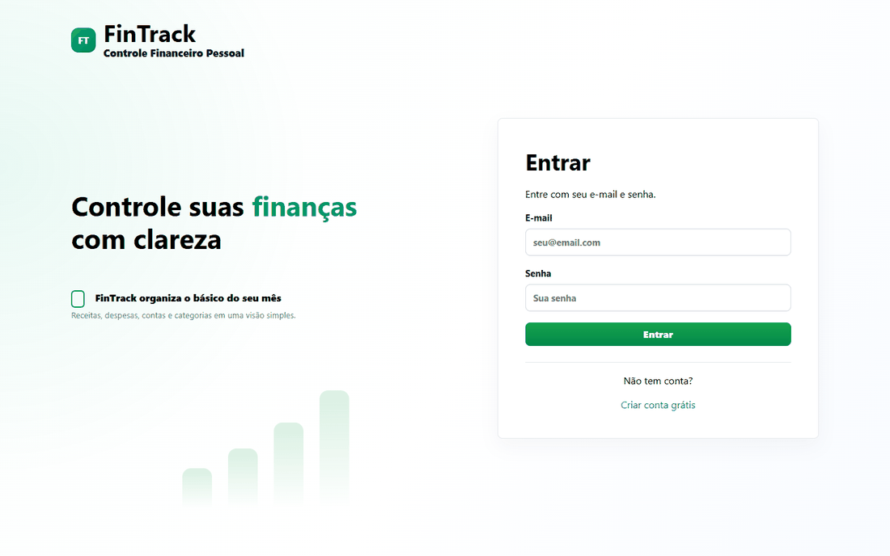
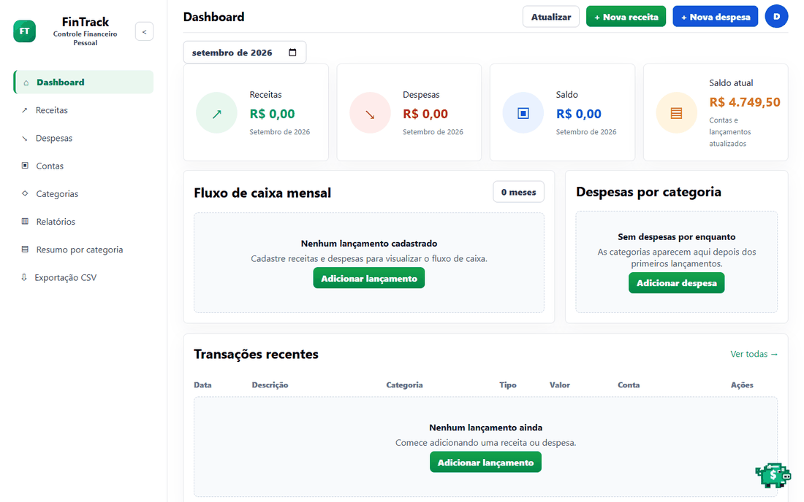
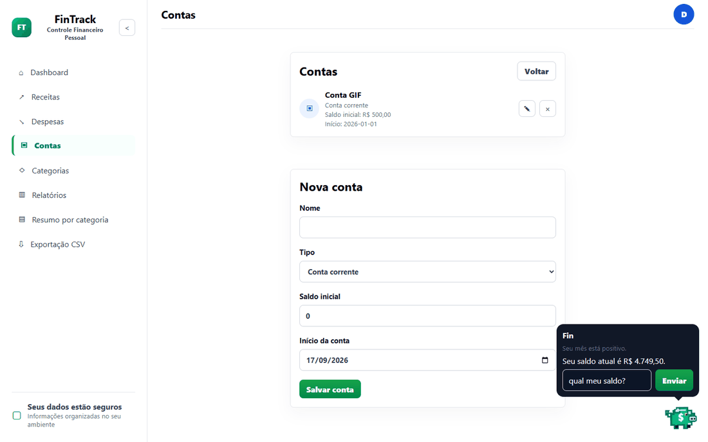

# FinTrack

[](https://github.com/BernTomaz/FinTrack/actions/workflows/ci.yml)

Sistema web para controle financeiro pessoal, com cadastro de receitas, despesas, contas, categorias, dashboard mensal e exportação CSV.

## Visão do produto

Tela de login com acesso direto, sem atalhos para recursos fora do MVP.



Dashboard mensal com receitas, despesas, saldo do mês, saldo atual e gráficos baseados nos lançamentos reais.



Tela de contas mostrando saldo inicial e data de início, usados no cálculo do saldo atual por período.



## Documentação

- [Wiki do projeto](docs/wiki.md)
- [Visão geral](docs/etapas/00-etapa-visao-geral.md)
- [Arquitetura](docs/arquitetura.md)
- [Configuração local](docs/configuracao.md)
- [Endpoints](docs/endpoints.md)
- [Testes](docs/testes.md)
- [Roadmap](docs/roadmap.md)
- [Status do projeto](docs/status-projeto.md)
- [Fluxo geral](docs/fluxos/00-fluxo-geral.md)
- [Roadmap de implementação](docs/fluxos/10-roadmap-implementacao.md)

## Stack

Backend:

- .NET 10
- ASP.NET Core Web API
- Entity Framework Core
- SQL Server
- JWT Authentication

Frontend:

- Angular 20
- TypeScript
- Reactive Forms
- HttpClient
- Layout responsivo mobile-first

Testes:

- xUnit
- FluentAssertions

Infra:

- Docker
- Docker Compose

## Estrutura

```text
FinTrack/
  src/
    FinTrack.Api/
    FinTrack.Application/
    FinTrack.Domain/
    FinTrack.Infrastructure/
    FinTrack.Web/
  tests/
    FinTrack.Tests/
  docs/
    etapas/
    fluxos/
    operacao/
  docker/
    sqlserver/
  scripts/
    database/
    demo/
    frontend/
```

## MVP

- Cadastro de usuário
- Login
- Cadastro de contas financeiras
- Cadastro de categorias
- Cadastro de lançamentos financeiros
- Listagem e filtros de lançamentos
- Dashboard mensal
- Gráfico de fluxo de caixa com dados reais
- Exportação CSV de lançamentos
- Exclusão de lançamentos
- Bloqueio de exclusão de contas e categorias com lançamentos vinculados

## Modo de desenvolvimento

O projeto segue uma abordagem simples: menos abstração, menos dependência e mais fluxo direto. Recursos fora do MVP ficam documentados para depois.

A solução .NET usa o formato `.slnx`.

## Status

MVP funcional validado localmente. O projeto já possui autenticação, contas, categorias, lançamentos, dashboard mensal, exportação CSV, frontend Angular e testes principais.

Contas e categorias com lançamentos vinculados não podem ser excluídas diretamente. Para removê-las, exclua primeiro os lançamentos relacionados.

## Execução local

Backend:

```powershell
dotnet restore FinTrack.slnx -m:1
dotnet build FinTrack.slnx --no-restore -m:1
dotnet test tests\FinTrack.Tests\FinTrack.Tests.csproj --no-restore -m:1
dotnet run --project src\FinTrack.Api
```

Frontend:

```powershell
cd src\FinTrack.Web
npm install
npm start
```

Endereços locais:

- API: `http://localhost:5080`
- Frontend local: `http://localhost:4200`
- Frontend Docker: `http://localhost:4201`
- Health check: `http://localhost:5080/health`
- OpenAPI: `http://localhost:5080/openapi/v1.json`
- Swagger UI: `http://localhost:5080/swagger`

Builds:

```powershell
dotnet publish src\FinTrack.Api\FinTrack.Api.csproj -c Release
cd src\FinTrack.Web
npm run build
```

Docker:

```powershell
Copy-Item .env.example .env
docker compose build
docker compose up -d
```

O `docker compose up -d` sobe SQL Server, API e frontend com health checks. As imagens locais são `fintrack-api:latest` e `fintrack-web:latest`. A API aplica migrations automaticamente ao iniciar.

Configurar URL da API no frontend:

```html
<meta name="fintrack-api-url" content="http://localhost:5080">
```

Em desenvolvimento local e Docker, o valor padrão é `http://localhost:5080`. Para trocar:

```powershell
.\scripts\frontend\set-api-url.ps1 -ApiUrl "https://sua-api.exemplo.com"
```

Criar dados de demonstração em uma API em execução:

```powershell
.\scripts\demo\seed-demo.ps1
```

Aplicar migrations manualmente, se necessário:

```powershell
dotnet ef database update --project src\FinTrack.Infrastructure --startup-project src\FinTrack.Api --no-build
```

Usar SQL Server local ou LocalDB:

```powershell
dotnet ef database update --project src\FinTrack.Infrastructure --startup-project src\FinTrack.Api --no-build --connection "Server=localhost;Database=FinTrackDb;Trusted_Connection=True;Encrypt=False;TrustServerCertificate=True"
dotnet ef database update --project src\FinTrack.Infrastructure --startup-project src\FinTrack.Api --no-build --connection "Server=(localdb)\MSSQLLocalDB;Database=FinTrackDb;Trusted_Connection=True;Encrypt=False;TrustServerCertificate=True"
```
