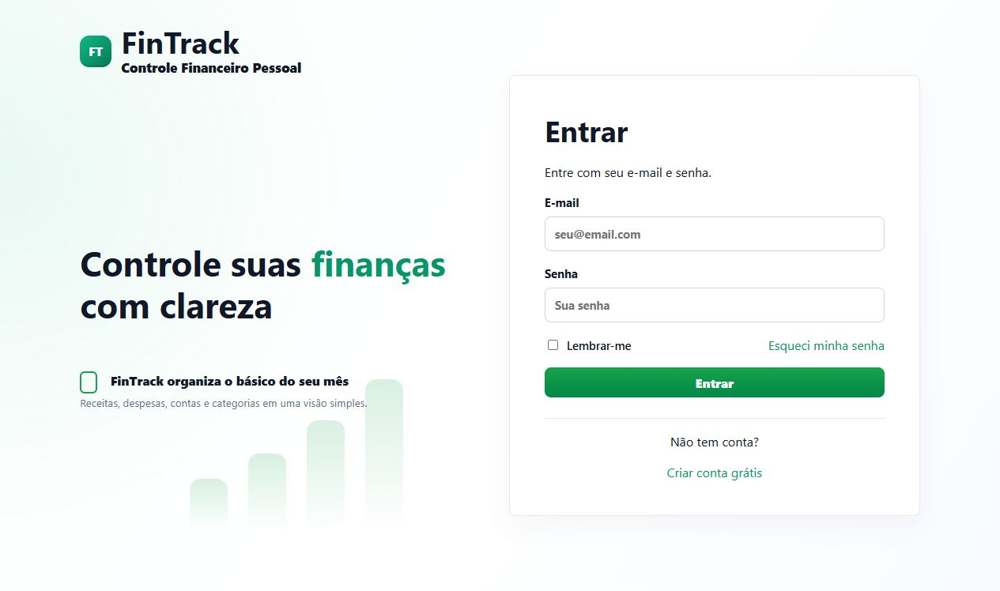

# FinTrack

[](https://github.com/BernTomaz/FinTrack/actions/workflows/ci.yml)

Sistema web para controle financeiro pessoal, com cadastro de receitas, despesas, contas, categorias, dashboard mensal e exportação CSV.



## Documentação

- [Visão geral](docs/etapas/00-etapa-visao-geral.md)
- [Arquitetura](docs/arquitetura.md)
- [Configuração local](docs/configuracao.md)
- [Endpoints](docs/endpoints.md)
- [Testes](docs/testes.md)
- [Roadmap](docs/roadmap.md)
- [Status do projeto](docs/status-projeto.md)
- [Fluxo geral](docs/fluxos/00-fluxo-geral.md)
- [Roadmap de implementação](docs/fluxos/10-roadmap-implementacao.md)

## Stack

Backend:

- .NET 10
- ASP.NET Core Web API
- Entity Framework Core
- SQL Server
- JWT Authentication

Frontend:

- Angular 20
- TypeScript
- Reactive Forms
- HttpClient
- Layout responsivo mobile-first

Testes:

- xUnit
- FluentAssertions

Infra:

- Docker
- Docker Compose

## Estrutura

```text
FinTrack/
  src/
    FinTrack.Api/
    FinTrack.Application/
    FinTrack.Domain/
    FinTrack.Infrastructure/
    FinTrack.Web/
  tests/
    FinTrack.Tests/
  docs/
    etapas/
    fluxos/
    operacao/
  docker/
    sqlserver/
  scripts/
    database/
```

## MVP

- Cadastro de usuário
- Login
- Cadastro de contas financeiras
- Cadastro de categorias
- Cadastro de lançamentos financeiros
- Listagem e filtros de lançamentos
- Dashboard mensal
- Gráfico de fluxo de caixa com dados reais
- Exportação CSV de lançamentos
- Exclusão de lançamentos
- Bloqueio de exclusão de contas e categorias com lançamentos vinculados

## Modo de Desenvolvimento

O projeto segue uma abordagem simples: menos abstração, menos dependência e mais fluxo direto. Recursos fora do MVP ficam documentados para depois.

A solução .NET usa o formato `.slnx`.

## Status

MVP funcional validado localmente. O projeto já possui autenticação, contas, categorias, lançamentos, dashboard mensal, exportação CSV, frontend Angular e testes principais.

Contas e categorias com lançamentos vinculados não podem ser excluídas diretamente. Para removê-las, exclua primeiro os lançamentos relacionados.

## Execução Local

Restaurar e compilar o backend:

```powershell
dotnet restore FinTrack.slnx -m:1
dotnet build FinTrack.slnx --no-restore -m:1
```

Executar a API:

```powershell
dotnet run --project src\FinTrack.Api
```

Endereços locais:

- API: `http://localhost:5080`
- Health check: `http://localhost:5080/health`
- OpenAPI: `http://localhost:5080/openapi/v1.json`
- Swagger UI: `http://localhost:5080/swagger`

Usar SQL Server via Docker:

```powershell
Copy-Item .env.example .env
docker compose up -d
dotnet ef database update --project src\FinTrack.Infrastructure --startup-project src\FinTrack.Api --no-build
```

Usar SQL Server local:

```powershell
dotnet ef database update --project src\FinTrack.Infrastructure --startup-project src\FinTrack.Api --no-build --connection "Server=localhost;Database=FinTrackDb;Trusted_Connection=True;Encrypt=False;TrustServerCertificate=True"
```

Usar LocalDB:

```powershell
dotnet ef database update --project src\FinTrack.Infrastructure --startup-project src\FinTrack.Api --no-build --connection "Server=(localdb)\MSSQLLocalDB;Database=FinTrackDb;Trusted_Connection=True;Encrypt=False;TrustServerCertificate=True"
```

Instalar e executar o frontend:

```powershell
cd src\FinTrack.Web
npm install
npm start
```
